# Cyber-Awarness-Lab
Cyber Awareness Lab — An interactive cybersecurity awareness toolkit designed to educate users about phishing, password security, social engineering, digital privacy, safe browsing, OSINT concepts, and common cyber threats. Built with a practical, modern security-focused interface for learning and awareness.

<div align="center">


# 🛡️ Cyber Awareness Lab

### Think Before You Click.

<p>
  <b>Interactive Cybersecurity Awareness & Learning Toolkit</b>
</p>

<p>
  
  
  
  
  
</p>

</div>

---

## 🛡️ About

**Cyber Awareness Lab** is an interactive cybersecurity awareness and learning toolkit designed to help users understand cyber threats, digital safety, phishing, password security, social engineering, OSINT concepts and essential cybersecurity practices.

The project brings cybersecurity awareness, educational modules and practical security utilities together in a modern security-focused interface.

# ☣️ Cyber Threat Awareness Modules

Cyber Awareness Lab includes educational modules that explain common
cybersecurity threats, their impact, warning signs, and basic prevention
measures.

> 🛡️ **Purpose:** Cybersecurity Education, Awareness & Prevention

---

## 🦠 Malware

Malware is a general term for malicious software designed to disrupt systems,
steal information, damage data, or enable unauthorized activity.

### Why is it important?

Understanding malware helps users recognize suspicious files, applications,
downloads, and unusual device behavior.

**Examples:**  
`Ransomware` • `Spyware` • `Trojan` • `Worm` • `Adware` • `Rootkit` • `Keylogger`

---

## 🔒 Ransomware

Ransomware is a type of malware that can make files or systems inaccessible
and may be used to extort victims.

### Why is it dangerous?

- Can prevent access to important files
- Can disrupt organizations and services
- May involve data theft and extortion
- Recovery can be difficult and expensive

### 🛡️ Awareness

- Maintain reliable backups
- Keep software updated
- Use strong authentication
- Avoid suspicious attachments and links

---

## ⌨️ Keylogger

A keylogger is software or hardware capable of recording keyboard input.
Malicious keyloggers can potentially capture sensitive information.

### Why is it dangerous?

A malicious keylogger may expose:

- Login credentials
- Messages
- Personal information
- Other information typed by the user

### 🛡️ Awareness

Install software only from trusted sources and keep security protections
enabled.

---

## 🌐 DDoS

**Distributed Denial-of-Service (DDoS)** attacks attempt to overwhelm an
online service with traffic or requests, making it difficult for legitimate
users to access.

### Possible Impact

- Website downtime
- Service disruption
- Network congestion
- Business interruption

### 🛡️ Awareness

Organizations can use traffic monitoring, filtering, rate limiting, and
appropriate network protection.

---

## ⛏️ Cryptojacking

Cryptojacking refers to the unauthorized use of another person's device
resources for cryptocurrency mining.

### Common Warning Signs

- Unusual CPU/GPU usage
- Device becoming unusually slow
- Increased power consumption
- Unexpected resource consumption

### 🛡️ Awareness

Keep systems updated, use trusted security software, and investigate
unexplained resource usage.

---

## 📢 Adware

Adware is software that displays unwanted advertisements or redirects users
toward advertising-related content.

### Possible Problems

- Unwanted pop-ups
- Browser redirects
- Reduced system performance
- Exposure to suspicious websites

### 🛡️ Awareness

Be careful when installing free software and review installation options
before accepting additional components.

---

## 🕵️ Spyware

Spyware is software designed to monitor activity or collect information
without appropriate user awareness or consent.

### Why is it dangerous?

It can create serious privacy risks and potentially expose sensitive
information.

### 🛡️ Awareness

- Install applications from trusted sources
- Review application permissions
- Keep software updated
- Monitor unusual device behavior

---

## 🐴 Trojan

A Trojan is malicious software that disguises itself as legitimate or useful
software to trick a user into running it.

### Why is it dangerous?

After execution, it may enable additional malicious activity or compromise
information.

### 🛡️ Awareness

Do not blindly trust unknown applications, attachments, or downloads.

---

## 🪱 Worm

A computer worm is malware capable of spreading between systems, often
without requiring the same level of user interaction as other malware.

### Possible Impact

- Rapid malware propagation
- Network congestion
- Multiple compromised systems
- Service disruption

### 🛡️ Awareness

Regular updates, security controls, and network segmentation can help reduce
the risk of malware spreading.

---

## 🥷 Rootkit

A rootkit is associated with techniques or software designed to maintain
unauthorized access while attempting to hide its presence.

### Why is it dangerous?

Its stealthy nature can make detection and investigation more difficult.

### 🛡️ Awareness

Use trusted security software, maintain system integrity, and investigate
unexpected system behavior.

---

## 🤖 Botnet

A botnet is a collection of compromised devices that can be remotely
controlled by an attacker.

### Possible Abuse

Compromised devices may be used for:

- Spam
- Information theft
- Coordinated attacks
- Other malicious activity

### 🛡️ Awareness

Keep devices patched, secure user accounts, and monitor unusual network
activity.

---

## 🎣 Phishing

Phishing is a social-engineering technique where attackers attempt to trick
users into interacting with malicious links, websites, messages, or
attachments.

### Common Warning Signs

- Unexpected messages
- Urgent requests
- Suspicious links
- Unknown attachments
- Fake login pages
- Requests for sensitive information

### 🛡️ Remember

**STOP → CHECK → VERIFY → THEN CLICK**

---

## 👤 Social Engineering

Social engineering focuses on manipulating people into taking actions that
may compromise security.

### Common Manipulation Techniques

- Urgency
- Impersonation
- Fear
- Authority
- Trust
- Fake offers

### 🛡️ Awareness

Always verify unexpected requests, especially requests involving passwords,
money, personal information, or account access.

---

## 🔑 Credential Theft

Credential theft involves obtaining usernames, passwords, authentication
tokens, or other information that can be used to access accounts.

### Why is it dangerous?

Compromised credentials can provide unauthorized access to personal or
organizational resources.

### 🛡️ Protection

- Use unique passwords
- Enable MFA
- Avoid suspicious login pages
- Never share authentication information

---

## 🗃️ Information Stealing

Information-stealing attacks attempt to obtain valuable data from devices,
applications, or accounts.

### Potentially Targeted Information

- Personal information
- Authentication information
- Documents
- Browser-related data
- Business information

### 🛡️ Awareness

Minimize unnecessary data exposure and protect accounts and devices with
appropriate security controls.

---

## 🚪 Backdoor

A backdoor is a mechanism that can provide unauthorized or hidden access to
a system.

### Why is it dangerous?

An attacker may use unauthorized access to maintain control of a compromised
system.

### 🛡️ Awareness

Monitor unexpected accounts, services, applications, and system changes.

---

## 🌐 Man-in-the-Middle (MitM)

A Man-in-the-Middle attack occurs when an attacker positions themselves
between communicating parties and attempts to intercept or manipulate
communication.

### Possible Risks

- Information interception
- Communication manipulation
- Privacy exposure

### 🛡️ Awareness

Use secure connections, verify websites, and be cautious when using
untrusted networks.

---

## 💥 Zero-Day Vulnerability

A zero-day vulnerability is a security weakness that is unknown or has not
yet been patched by the responsible vendor.

### Why is it important?

Organizations may have limited time to respond when a newly discovered
vulnerability is actively exploited.

### 🛡️ Awareness

Layered security, monitoring, rapid updates, and vulnerability management
help reduce overall risk.

---


# 📸 Project Screenshots

## 🖥️ Main Dashboard

<div align="center">

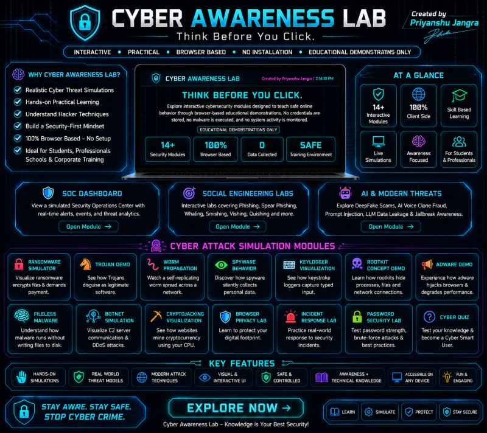

</div>

---

## 🛡️ Cyber Awareness Modules

<div align="center">

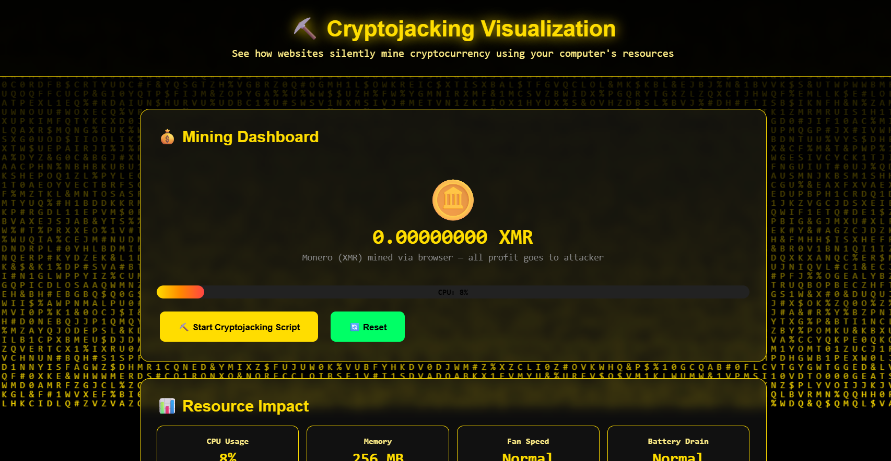

</div>

---

<div align="center">

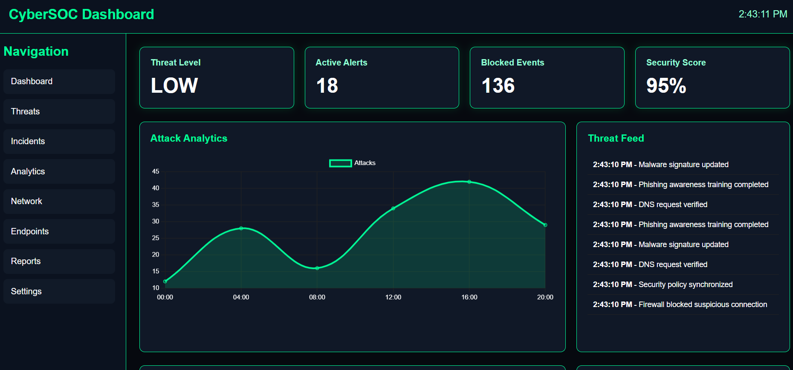

</div>


---

<div align="center">

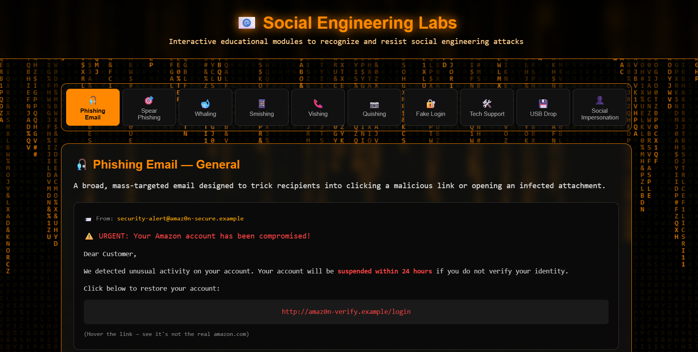

</div>

--

<div align="center">

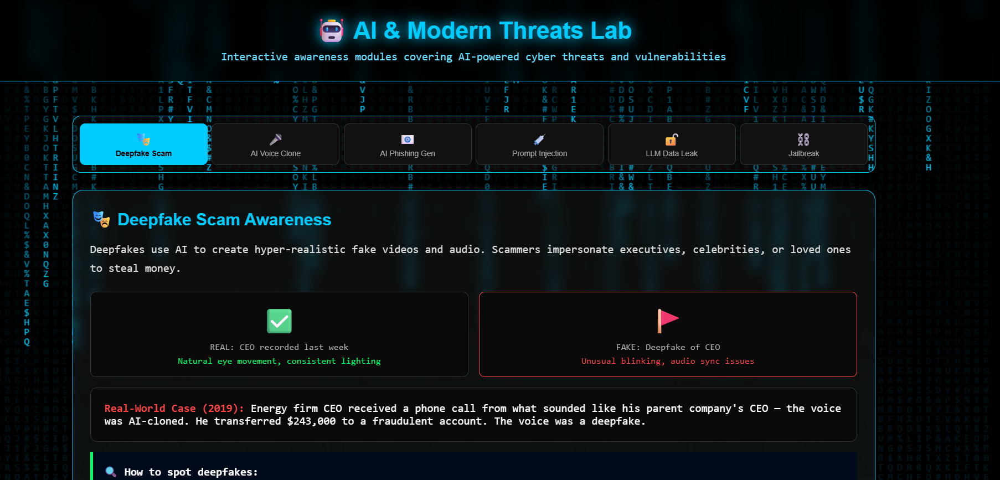

</div>

--

<div align="center">

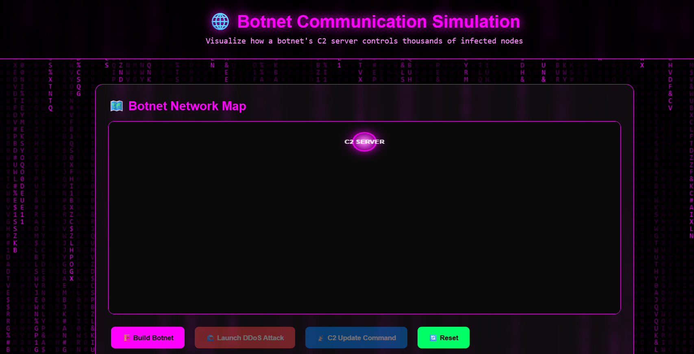

</div>

--

<div align="center">

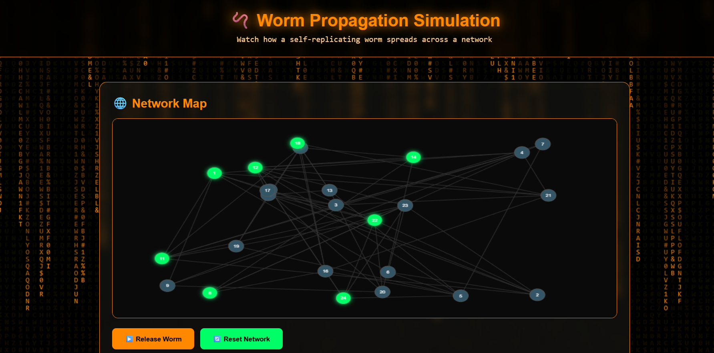

</div>

<div align="center">

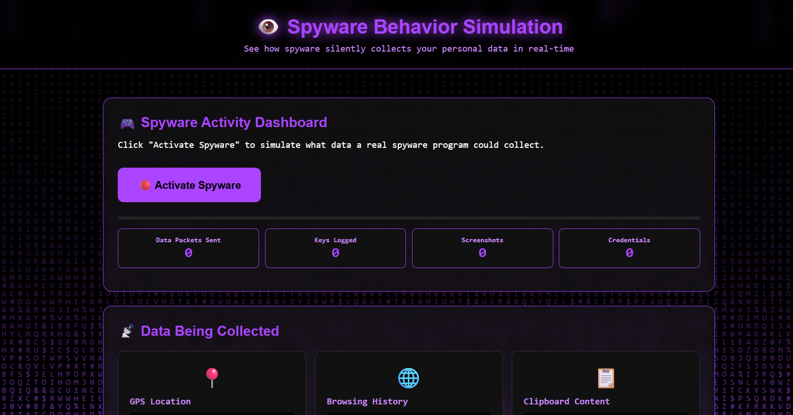

</div>

<div align="center">

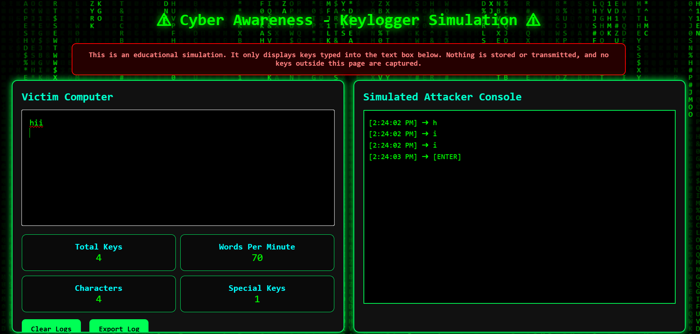

</div>

<div align="center">

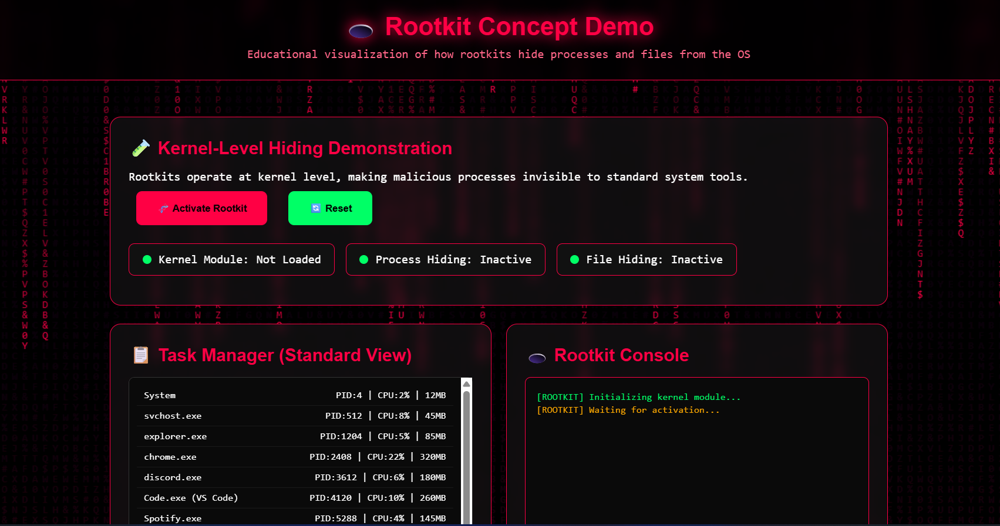

</div>

<div align="center">

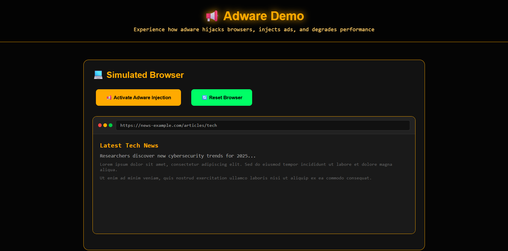

</div>

<div align="center">

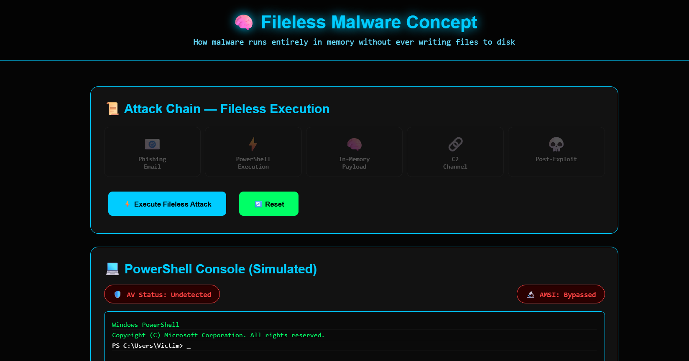

</div>


# 🚀 Key Features

- 🛡️ Cybersecurity Awareness Modules
- 🎣 Phishing Awareness
- 🔐 Password Security
- 👤 Social Engineering Awareness
- 🌐 Safe Browsing
- 📧 Email Security
- 📱 Mobile Security Awareness
- 🔎 OSINT Awareness
- 🧩 Cybersecurity Quizzes
- 🔢 Hashing & Encoding Utilities
- 📊 Security Dashboard
- ⚡ Interactive Learning Modules
- 📱 Responsive Interface

---

# 🧰 Tech Stack

<div align="center">


</div>

---

# 🎯 Project Objective

The goal of Cyber Awareness Lab is to make cybersecurity education more **interactive, practical and easy to understand**.

It focuses on helping users:

- Identify common cyber threats
- Recognize phishing attempts
- Understand social engineering
- Improve password security
- Protect personal information
- Understand digital footprints
- Learn fundamental cybersecurity concepts

---

# ⚠️ Disclaimer

Cyber Awareness Lab is intended for **cybersecurity education, awareness and authorized security testing only**.

Always ensure that security testing is performed only on systems, accounts, files or networks that you own or have explicit permission to test.

---


<div align="center">

### 🛡️ CYBER AWARENESS LAB

**Learn • Identify • Protect**

**Think Before You Click.**

© 2026 Cyber Awareness Lab · Created by Priyanshu Jangra

</div>

# 🛡️ Cyber Safety Framework

Cyber Awareness Lab follows a simple approach:

```text
┌──────────────┐
│   IDENTIFY   │
└──────┬───────┘
       ↓
┌──────────────┐
│  UNDERSTAND  │
└──────┬───────┘
       ↓
┌──────────────┐
│   PREVENT    │
└──────┬───────┘
       ↓
┌──────────────┐
│    RESPOND   │
└──────────────┘
